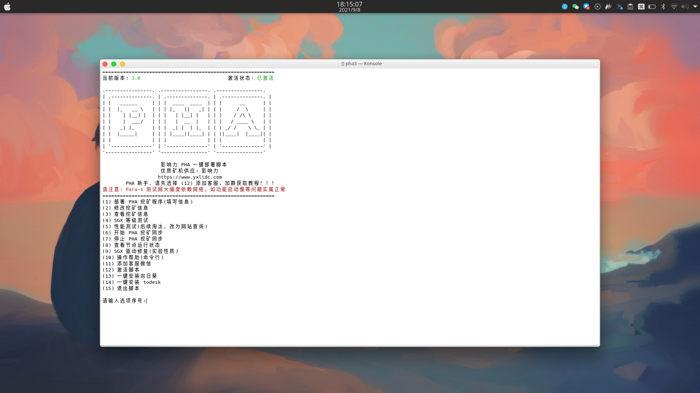

# pha_onekey
>PHA 环境一键部署脚本  

```bash
.
├── Decrypt.sh  # Decrypt.sh 激活码生成脚本
├── pha         # 经过 shc 加密的脚本
├── pha.sh      # pha.sh 部署脚本  
├── README.md
└── view.png
```

当前版本: 3.0

### 脚本主要功能

- 一键部署 PHA
- 一键挖矿同步
-  SGX 等级测试
-  Score_test 性能测试
-  SGX 驱动修复
-  一键安装向日葵
-  一键安装 todesk
-  解决了同步失败导致 PHA 脚本自动删除的问题
-  增加了查看同步进度的功能
-  解决了依赖安装失败的问题
-  其他细节优化

### 初次安装

- 在 Ubuntu 终端下，执行以下命令:

```bash
curl -o pha https://gitee.com/kimjungwha/pha_onekey/raw/master/pha && sudo chmod +x pha && ./pha
# 如果上一条命令报错，执行以下命令
wget -O pha https://gitee.com/kimjungwha/pha_onekey/raw/master/pha && sudo chmod +x pha && ./pha
```
### 后续使用

- 在 Ubuntu 终端下，执行以下命令:
```bash
pha
```

- 按序号选择对应的选项即可

    

### 常见问题

1. 关于激活
    * 脚本安装后，默认状态未激活
    * 选择 `添加客服微信` 将机器码发给客服
    * 收到客服发送的激活码时，选择 `激活脚本` 将激活码粘贴到脚本激活

2. 其他问题，添加客服微信，客服会拉你进群

